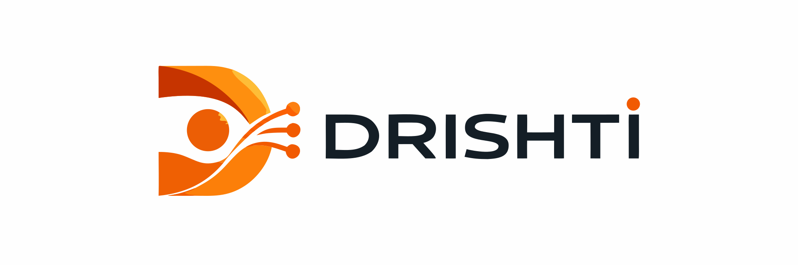
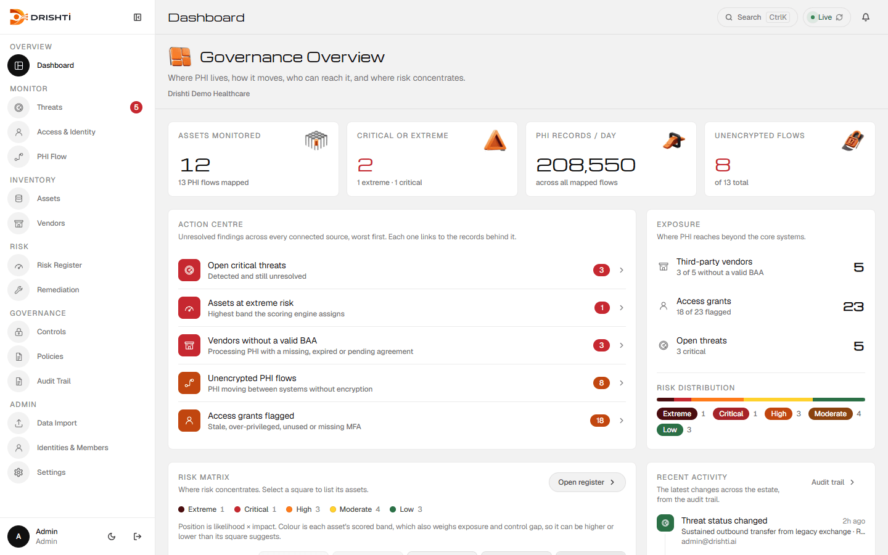
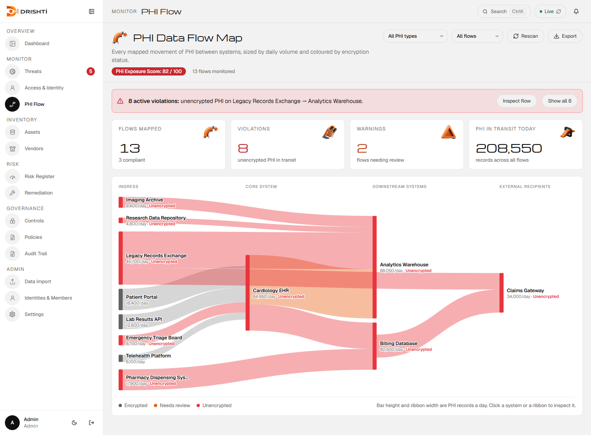
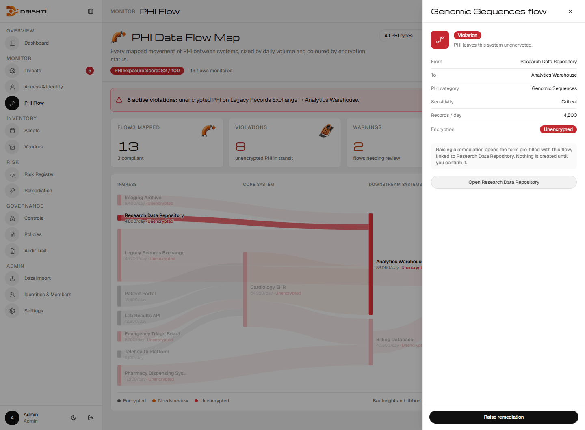
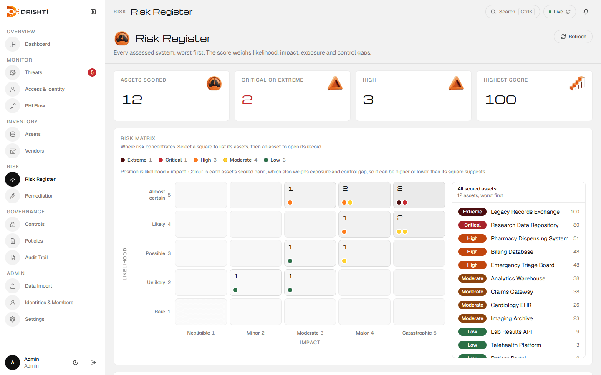
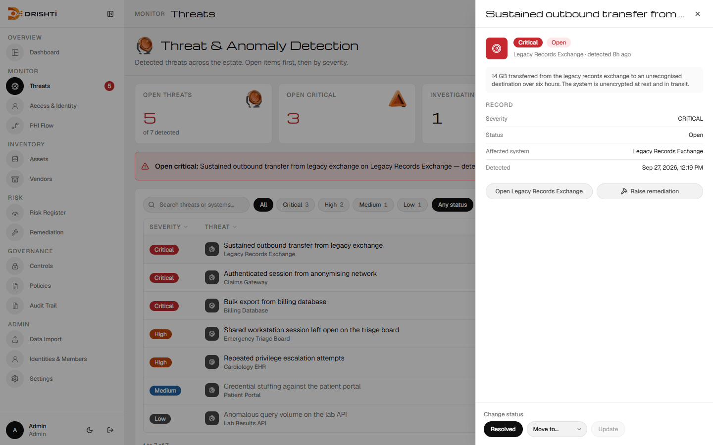
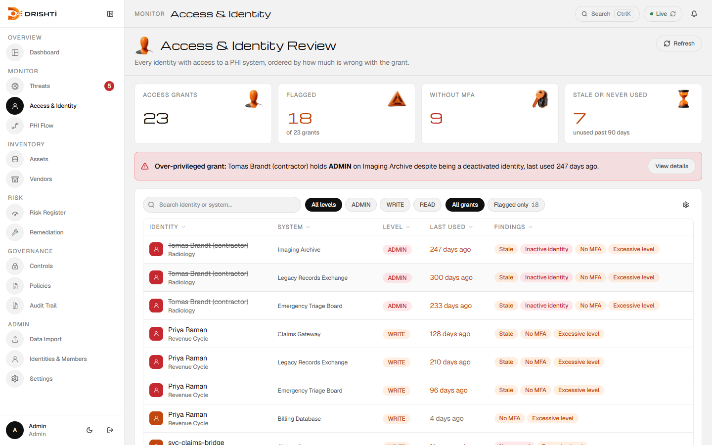
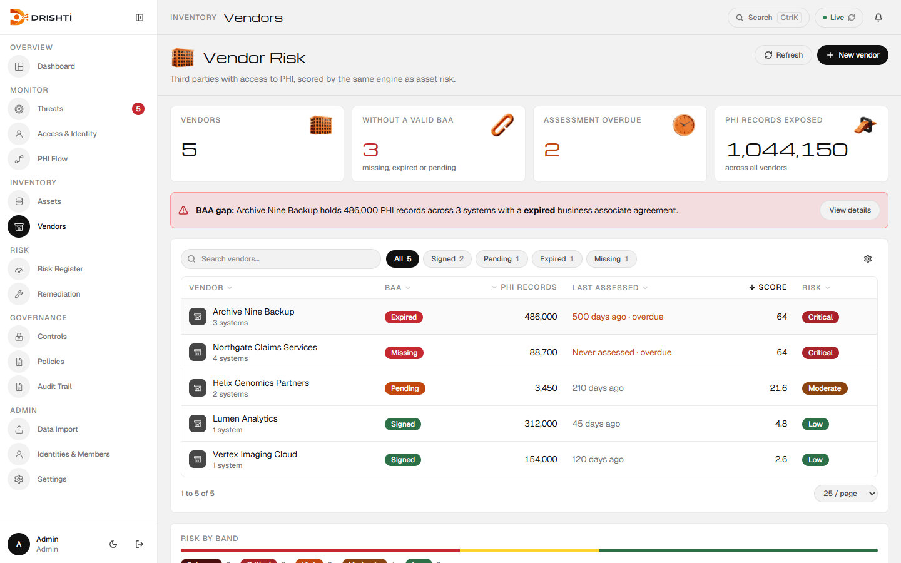
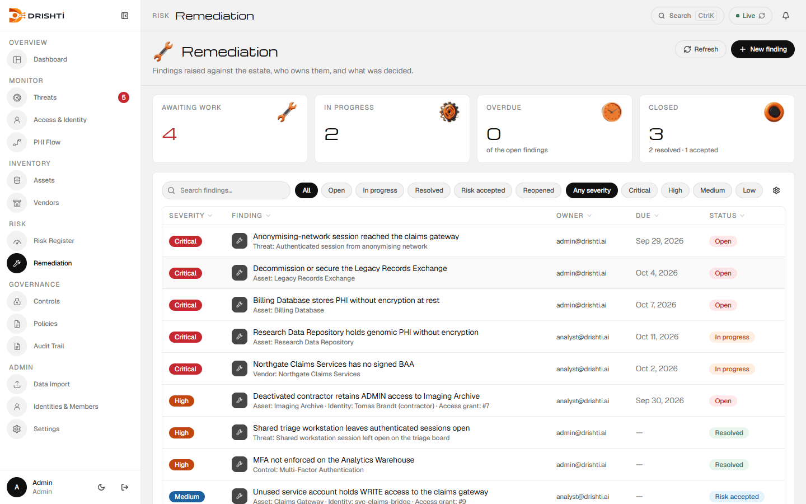
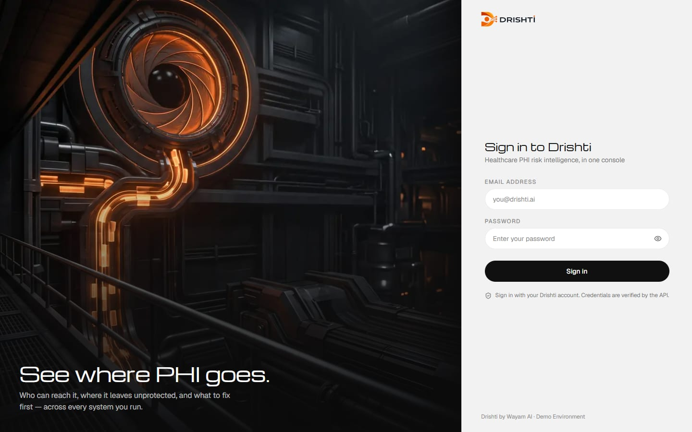

<div align="center">

<picture>
  <source media="(prefers-color-scheme: dark)" srcset="docs/brand/drishti-dark.svg">
  
</picture>

### Healthcare PHI risk intelligence, in one console

See where patient data lives, how it moves, who can reach it, which vendors touch it,
and what to fix first — then track the fix to done.


<br>

<picture>
  <source media="(prefers-color-scheme: dark)" srcset="docs/screenshots/dashboard-dark.png">
  
</picture>

</div>

---

## Why Drishti

*दृष्टि — vision, sight.*

Most healthcare organisations can list the systems they run. Very few can say,
on demand, **where PHI actually sits, how it moves between those systems, who
still has access to it, and which vendors are exposed**. That picture is
usually spread across spreadsheets, ticket queues and vendor folders, and it
is rebuilt by hand every time an auditor or an incident asks.

Drishti keeps that picture live, puts the worst problems first, and carries
each one from *found* to *recorded* to *fixed* without retyping anything:

```
 Find                      Record                       Act
 ─────────────────────     ────────────────────────     ──────────────────────────
 Dashboard · Action        Inspector with only the      Raise remediation, pre-filled
 Centre · PHI flow map ─▶  facts the API returns    ─▶  and linked to the asset, threat,
 Risk matrix · Threats                                  grant or vendor it came from
```

Every screen reads the Drishti API. Nothing is driven by fixture data, and a
screen that has no data says so rather than inventing some.

---

## A tour

### PHI flow map

Every recorded movement of PHI between systems, as a volume-weighted Sankey.
A bar's height is a system's daily throughput; a ribbon is exactly as thick as
the records it carries; red means the flow is unencrypted. Hover a system or a
flow to isolate it.



Click a flow to inspect it: route, PHI category, sensitivity, volume and
encryption, with **Raise remediation** pre-filled as a transit-control finding.



### Risk register

Every system scored on likelihood × impact × exposure × control gap. The
matrix shows where risk concentrates; select a square to list its systems,
then a system to open its record.



### Threats

Detected threats against the systems they affect. The inspector offers only
the status changes the platform will accept from the current state, and hands
off to Remediation in one click.



### Access & identity

Every grant to a PHI system, ordered by how much is wrong with it: stale,
never used, missing MFA, excessive, or held by a deactivated identity.



### Vendors

Third parties that touch PHI, with BAA status, assessment currency and a
score from the same engine as asset risk.



### Remediation

The findings register: owner, due date, severity and a lifecycle that keeps
*Resolved* and *Risk accepted* distinct in every count.



<details>
<summary><b>Also in the box</b></summary>

<br>

- **Assets** — every system holding PHI, with a seven-tab detail drawer.
- **Controls** and **Policies** — safeguards, how well they work, and the policy that requires them.
- **Audit Trail** (admin) — who did what, when, filterable by action.
- **Data Import** (admin) — CSV import with a validated preview before anything is written.
- **Identities & Members** — who can reach PHI, and who can sign in to Drishti.
- **Global search** — <kbd>Ctrl</kbd>/<kbd>⌘</kbd> + <kbd>K</kbd> from anywhere.
- **Light and dark** — a toggle, remembered per browser.
- **Deep links** — every list seeds its filters from the URL, so `/threats?severity=CRITICAL` or `/access?flaggedOnly=true` land on exactly those records.

<br>



</details>

---

## Quick start

**Prerequisites:** Node.js 20+ and a running Drishti API
([WayamAI/MedGuard_Shield_Backend](https://github.com/WayamAI/MedGuard_Shield_Backend), port 4000 by default).

```bash
npm install
cp .env.example .env.local        # set VITE_API_BASE_URL, e.g. http://localhost:4000
npm run dev                       # http://localhost:8080
```

`VITE_API_BASE_URL` is **required** — there is no mock fallback, and without
it every data screen shows its error state. Demo accounts come from the
backend seed; see the [user guide](docs/user-guide.md).

| Script | What it does |
|---|---|
| `npm run dev` | Dev server on port 8080 (falls back to the next free port) |
| `npm run build` | Production build into `dist/` |
| `npm run preview` | Serve the production build locally |
| `npm run lint` | ESLint — CI requires zero problems |
| `npm test` | Vitest, once |
| `npm run test:watch` | Vitest in watch mode |

> Use **npm**. The repo carries only `package-lock.json`.

---

## How it's built

| Layer | Choice |
|---|---|
| App | [Vite](https://vitejs.dev/) · [React 18](https://react.dev/) · TypeScript |
| Styling | [Tailwind CSS](https://tailwindcss.com/) on the Chronos design tokens |
| Data | [TanStack Query](https://tanstack.com/query) behind one shared `useApiQuery` hook |
| Routing | [React Router 6](https://reactrouter.com/), with role-gated routes |
| UI | [Lucide](https://lucide.dev/) interface icons, [Sonner](https://sonner.emilkowal.ski/) toasts, hand-built SVG charts |
| Tests | [Vitest](https://vitest.dev/) + Testing Library |

**Data.** Every read goes through `useApiQuery` (`src/hooks/useApiQuery.ts`),
which adds polling, a faster retry cadence while the API is down, and an
`isReconnecting` state so a screen keeps its last good data behind a notice
instead of blanking out.

**Sign-in.** The access token (JWT, one hour) lives in memory only — never in
`localStorage`. The refresh token is an httpOnly cookie script cannot read; on
load the app calls `/api/auth/refresh` so a reload keeps you signed in.
Signing out clears the token locally first, so it works even if the API is
unreachable.

**Roles.** Administrator, Analyst and Viewer. Screens a role cannot use are
left out of the menu rather than shown and refused; action buttons follow the
same rule.

<details>
<summary><b>Endpoints each screen reads</b></summary>

<br>

| Screen | Source |
| --- | --- |
| Dashboard | `/api/assets`, `/api/risks`, `/api/dataflows`, `/api/vendors`, `/api/access/summary`, `/api/threats/summary` |
| Threats | `/api/threats` (+ `/summary`, `/:id/status`) |
| Access & Identity | `/api/access` (+ `/summary`, `/:id/revoke`, `/:id/review`) |
| PHI Flow | `/api/dataflows` |
| Assets | `/api/assets` (+ `/:id` detail graph) |
| Vendors | `/api/vendors` |
| Risk Register | `/api/risks` (+ `/:assetId/recompute`) |
| Remediation | `/api/remediations` (+ `/summary`, `/:id/status`, `/:id/assign`) |
| Controls, Policies | `/api/controls`, `/api/policies` |
| Audit Trail | `/api/audit` |
| Data Import | `/api/import` (contract, template, validate, commit) |
| Identities & Members, Settings | `/api/identities`, `/api/organization` |
| Global search | `/api/search` |

</details>

---

## Design system

Drishti shares the **Chronos** design system with its sibling Wayam AI
console, so the two read as one product family.

- **Tokens** — `src/styles/tokens.css`: a reference palette (`--ref-*`) and
  semantic tokens (`--sem-*`) consumed through Tailwind. Components never use a
  raw colour.
- **Surfaces** — light grey page, white containers, hairline strokes, no
  panel shadows. Michroma for display and figures, Geist for everything else.
- **Controls** — pills throughout. The primary action is black in light mode
  and white in dark; Wayam orange is identity only, never a control.
- **Risk bands** — five bands with a colour-blind-checked ramp, identical in
  every badge, matrix dot and distribution bar.
- **3D marks** — 61 orange renders in `public/brand/icons-3d/`, one per page
  header and KPI tile, and in empty and error states. Never below 28px; table
  badges stay text. The slot map and the prompts for the marks still to make
  are in [`docs/design/3d-icons.md`](docs/design/3d-icons.md).
- **Formatting** — numbers and dates always render in `en-US`
  (`src/lib/format.ts`), so a figure reads the same for every viewer.

---

## Project structure

```
src/
  pages/        One file per route
  components/   Layout (sidebar, top bar, command palette), DataTable,
                PhiSankey, RiskMatrix, DomainIcon, Drishti3DIcon,
                ui-bits (atoms), ui-patterns (page header, KPI tile, filters)
  hooks/        Session, useApiQuery, useListControls and per-endpoint hooks
  lib/          API client and wire types, mappers, tone, format, dates
  styles/       tokens.css — the design tokens
  test/         Vitest suites
public/brand/   Built 3D marks (WebP + PNG fallback)
design/         Source art for the line icons (not shipped)
demo-pack/      Realistic CSV files for demonstrating Data Import
docs/           Guides, API contract, customer and demo material
```

---

## Testing

```bash
npx vitest run --exclude "**/live-backend.test.tsx"   # what CI runs
npx vitest run src/test/live-backend.test.tsx          # needs a live API
```

CI (`.github/workflows/ci.yml`) runs typecheck, lint, tests and a build on
every push and pull request, and all four must pass.
`live-backend.test.tsx` **skips itself** when the API is unreachable, so check
its output for `[skip]` lines before counting it as coverage.

---

## Deploying

Hosted on **Vercel** (static build), against the API on **Render** and
Postgres on **Supabase**. `vercel.json` holds the frontend side; the backend's
`DEPLOYMENT.md` holds the rest. A `Dockerfile` + `nginx.conf` build an
equivalent container image.

```bash
vercel env add VITE_API_BASE_URL production   # https://<service>.onrender.com
vercel env add VITE_API_BASE_URL preview
vercel --prod
```

Worth knowing before changing anything:

- `VITE_API_BASE_URL` is inlined at **build** time. Changing it needs a redeploy.
- Assets build into `/static/`, not `/assets/`, because the app has an
  `/assets` route that Vite's default folder would shadow. Don't "fix" it.
- The API allowlists exact origins (`FRONTEND_ORIGIN`), so the production
  origin must be set on it before sign-in works. Preview URLs are not covered.
- Render's free tier sleeps after ~15 minutes idle; the first request after
  that waits 30 to 60 seconds.

---

## Documentation

| Document | For |
|---|---|
| [User guide](docs/user-guide.md) | People using Drishti — organised by the job to be done |
| [API contract](docs/api-contract.md) | Endpoints the frontend expects, including ones not yet built |
| [Architecture](docs/architecture.md) | How the pieces fit, and why |
| [Demo script](docs/demo/demo-script.md) · [Demo operations](docs/demo/demo-operations.md) | Running a customer demo |
| [One-pager](docs/customer/one-pager.md) · [FAQ](docs/customer/faq.md) · [Feature matrix](docs/customer/feature-matrix.md) | Customer-facing material |
| [3D icons](docs/design/3d-icons.md) | Every icon slot, and the prompts for the marks still to make |
| [TypeScript hardening](docs/typescript-hardening.md) | The plan for turning on `strictNullChecks` |
| [Demo pack](demo-pack/README.md) | Sample import files and the scenarios they tell |

---

## Known limitations

- **Notifications have no backend yet.** The bell opens a panel that says so
  rather than showing an invented feed; the event contract is in the
  [API contract](docs/api-contract.md).
- **Fixing a flow is recorded, not applied.** *Raise remediation* records the
  finding; the map changes when the underlying flow data does.
- **`strictNullChecks` is off.** See [TypeScript hardening](docs/typescript-hardening.md).

<br>

<div align="center"><sub>Drishti by <b>Wayam AI</b></sub></div>
